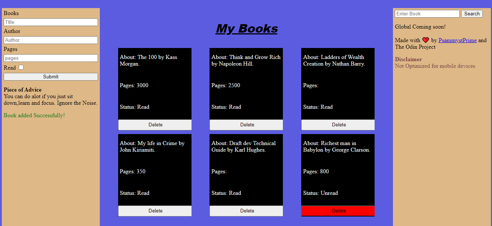

# The Grand Library

### 
People read lots of books throughout their life that they lose count. What If their was a way to record books one has read and also ones they're planning to read?  
This App provides a solution for that. You can save your books online and retrieve them anytime and also add new ones.
 
###
This is a light-weight book tracking web application built on HTML, CSS, and vanilla JavaScript.  
Made possible using Object Construtors and CRUD Principles.
 
# Coding Along?

###
1: Create a library array that will store the books.  
2:Create an Object Constructor that will create book objects.  
3:Create a function for adding and removing the books.  
* The function should include mechanism for; 
1. Creating a new book using the 'new' keyword.
 * This info is gotten from the user using a modal or form.
2. Pushing the book to the library array.
   * This requires you to be familiar with array methods.
  3. Displaying the book for the user.
   * This requires your knowledge looping through arrays and DOM manipulation. 
4. Removing the books from the screen and array at large.  
###
##### Have a smooth Library Experience ❤️.
